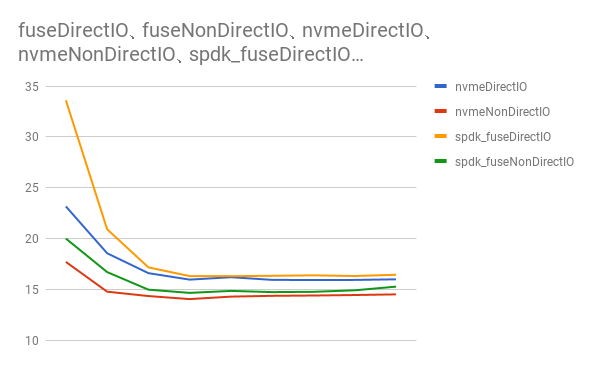

# Experiments

These are the explaination about benchmarking, middleware.  

## Benchmark

### Description

Benchmark is taken by a following command.  
```
bash run.sh benchmark -client-num=1024 -client-parallel=$n
```
where client-num is the total number of client connection, client-parallel is the maximum nubmer of simultaneous connections and $n is one of [2, 4, 8, ..., 512].  

You can find the benchmarking script .  

The file's size used in benchmarking is about 2MB.  

It is also taken under each of the following conditions.  

* hardDiskDirectIO
    * Using hard disk with page caching
* hardDiskNonDirectIO
    * Using hard disk without page caching
* nvmeDirectIO
    * Using NVMe SSD with page caching
* nvmeNonDirectIO
    * Using NVMe SSD without page caching
* spdk_fuseDirectIO
    * Using spdk fuse with page caching
* spdk_fuseNonDirectIO
    * Using spdk fuse without page chaching

Spdk fuse is a fuse system which accesses files with .

### Result

Y-axis is elapsed time [seconds].  
X-axis is the parameter of client-parallel.  

  

  

### Middleware

* Linux kerinel 4.10.0-35-generic
* Distribution Ubuntu 17.04
* fuse 3.1.1

