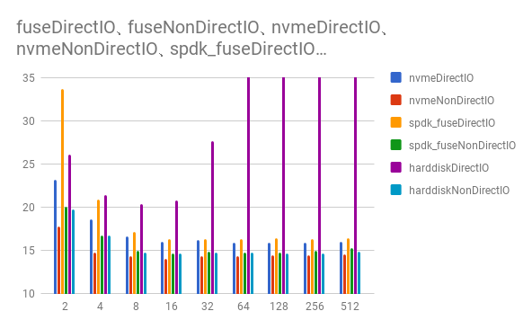

# Experiments

WIP  

These are the explaination about benchmarking, middleware, etc.  

## Benchmark

### Description

Benchmarks are taken under the following conditions.

* nvmeDirectIO
    * Using NVMe SSD with page caching
* nvmeNonDirectIO
    * Using NVMe SSD without page caching
* spdk_fuseDirectIO
    * Using spdk fuse with page caching
* spdk_fuseNonDirectIO
    * Using spdk fuse without page chaching

spdk fuse is a fuse system which accesses files by spdk.

### Result

Here is the result of benchmark.  

  

  

### Middleware

